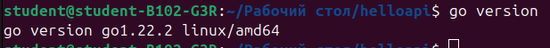
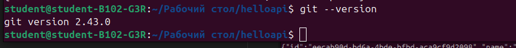
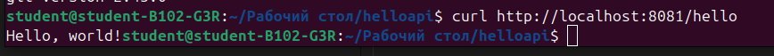
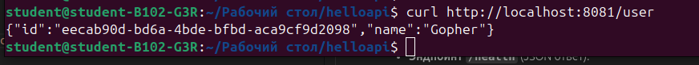
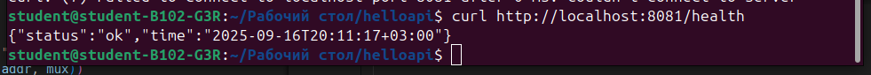
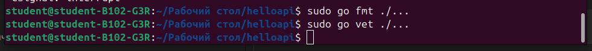

# ПЗ-1
# Ходыч Даниил Евгеньевич ЭФМО-02-25

HelloAPI

Минимальный HTTP-сервис на Go. Сервис предоставляет два эндпоинта и возвращает текстовые и JSON-ответы.

## Требования

- **Go**: версия 1.22.2
  
- **Git**: 2.43.0 для загрузки зависимостей
  

## Запуск и сборка

1.  **Клонирование и переход в директорию**:

```bash
git clone https://github.com/danthemo/PRAK_1.git
cd helloapi
```

2.  **Загрузка зависимостей**:

```bash
go mod tidy
```

3.  **Запуск в через консоль**:

```bash
go run ./cmd/server
```

Сервер запустится на порту по умолчанию (`:8080`).

4.  **Сборка бинарного файла**:

```bash
go build -o helloapi.exe ./cmd/server
```

Для запуска собранного файла:

```bash
./helloapi.exe
```

## Примеры запросов

После запуска сервера проверьте его работу с помощью `curl` или браузера.

- **Эндпоинт `/hello`** (текстовый ответ):

```bash
curl http://localhost:8080/hello
```

Ответ: `Hello, world!`


- **Эндпоинт `/user`** (JSON-ответ):

```bash
curl http://localhost:8080/user
```

Ответ:

```json
{ "id": "18fa418d-2dd4-4a28-9b54-1c78a06dcbcf", "name": "Gopher" }
```



- **Эндпоинт `/health`** (JSON ответ):

```bash
curl http://localhost:8080/user
```

Ответ:

```json
{ "status": "ok", "time": "2025-09-16T20:11:17+03:00" }
```



## Структура проекта

```bash
helloapi/
    cmd/
        server/
            main.go
    go.mod
    go.sum
```

## Конфигурация

Порт сервера можно изменить через переменную окружения `APP_PORT`.

**Пример для PowerShell:**

```powershell
$env:APP_PORT="8081"
go run ./cmd/server
```

Если переменная APP_PORT не задана, сервер будет использовать порт по умолчанию 8080.

## Go fmt и go vet



## Ответы на вопросы:

### 1. Что такое модуль Go? Роль go.mod, go.sum.

Модуль Go — это коллекция связанных Go-пакетов, собранных в единое целое. Модуль определяется файлом go.mod в корне проекта.

go.mod фиксирует:

    Имя модуля (например example.com/helloapi).

    Версию языка Go, на которую ориентирован проект.

    Список прямых зависимостей с их минимальными версиями.

go.sum — это файл с криптографическими хэшами всех зависимостей и их конкретных версий. Он нужен для гарантии, что у всех разработчиков и на системах сборки скачиваются и используются точно те же самые биты библиотек, что и у нас, обеспечивая безопасность и воспроизводимость сборки.

### 2. Отличия go run и go build. Когда что использовать?

go run — компиляция и мгновенный запуск (для разработки). go build — создание исполняемого файла.

### 3. Как сервер формирует JSON-ответ и зачем выставлять Content-Type: application/json?

Структура -> json.Encode() -> JSON. Заголовок Content-Type: application/json сообщает клиенту, что ответ — JSON, а не текст.

### 4. Как подключить и зафиксировать стороннюю библиотеку? Роль go get и go mod tidy.

go get URL — загрузка и добавление в go.mod.

go mod tidy — очистка неиспользуемых зависимостей и фиксация точных версий в go.sum.

### 5. Где и как читать переменные окружения для конфигурации порта?

В коде: os.Getenv("APP_PORT"). Если переменная пуста — используется значение по умолчанию (например, 8080).
